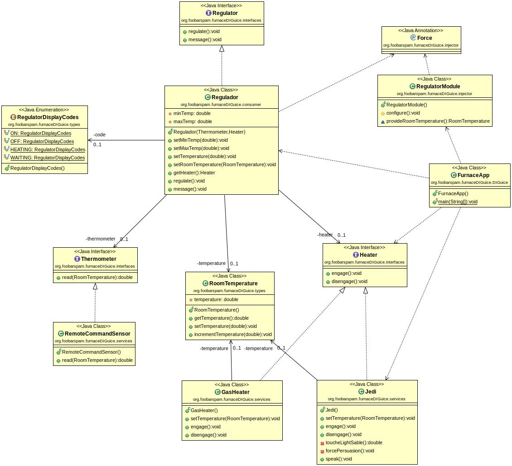

Ejemplo patrón DIP de SOLID
===========================

## Furnace DIP example

Ejemplo del patrón Inversión de dependencias de SOLID del libro "_Agile Principles, Patterns and Practices in C#_" de Robert C. Martin y Micah Martin.

Vamos a terminar el kata "_furnace DIP example_" construyendo el módulo del
programa que define, crea e inyecta las dependencias por nosotros.

El objetivo es también mejorar el código que escribimos en el kata de hace
semanas [furnace DIP kata](https://github.com/dfleta/furnace-DIP-kata), ya que nos ceñimos al propuesto en el libro, que no resulta muy eficiente.

## Google Guice

Para entender y practicar la inyección de dependencias (ojo, no la inversión) se ha utilizado la librería **Google Guice**, pues permite el estudio y configuración de los mecanismos utilizados en la inyección que, por ejemplo, Spring Boot oculta. Esta práctica se realiza previo paso a introducirnos en el uso de Spring Boot en el curso.

## Implementación

Este es el diagrama UML de lo que ya está construido, añadiendo un módulo
para definir, crear e inyectar las dependencias por nosotros.

- Hemos construido los **Servicios** (interfaces) `Thermometer` y `Heater`,
implementados por las clases `RemoteCommandSensor` y `Jedi` y `GasHeater` respectivamente.
- Hemos contruido el **Consumer**: `Regulator` pero no es una clase. Es necesario construir la interfaz `Regulate`.

Es necesario modificar la función `main()` -que se encargaba de crear las dependencias y pasárselas al método `regulate()`- para que haga uso de los nuevos componentes que vamos a desarrollar para automatizar la inyección de las dependencias. Estos nuevos componentes los construiremos usando la librería **Google Guice**.

Esta es la referencia de Google Guice "getting started" donde consultar cómo
escribir cada componente del inyector:

[Google Guice "getting started"](https://github.com/google/guice/wiki/GettingStarted)